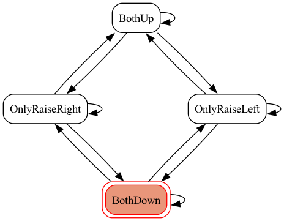

# raise-hand-game
OpenCVとMediaPipeを使った旗揚げ（手上げ）ゲーム

## 概要
- OpenCVでカメラキャプチャ
- MediaPipeで手検出（右 or 左）
- 指示の声はVOICEVOXで生成（ずんだもん）
- 以下のようなステートマシンを作成し正解状態を判定

## デモ

https://github.com/kassy11/raise-hand-game/assets/43651940/dafa598a-970f-4383-be58-4b40d7a02379

## ToDo
- 日英対応
